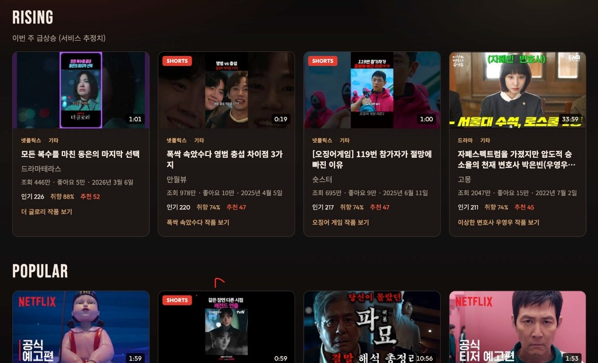

# K-PLAY Finder



최근 개봉 영화·넷플릭스·드라마 관련 유튜브 영상을 수집하고, 장르·콘텐츠 유형·영상 길이 취향에 따라 추천하는 모바일 우선 웹앱입니다.

## 주요 작업 내용

### MVP 구축
- React + Vite + TypeScript + Tailwind, Vercel Serverless(`/api/videos`)로 YouTube Data API v3 연동
- 작품 12개(`data/titles.json`) × 작품당 약 10개 영상 검색·상세 조회·정규화
- 추천 엔진: 취향일치·최신성·조회수 속도·참여도·채널신뢰 가중치로 상위 20개 추천 및 추천 이유 문구 생성
- 온보딩(취향), 홈(For You / Rising / Popular / 탭·필터), 작품 상세(예고편·리뷰·해석·인터뷰·Shorts 그룹)
- API Key는 서버에만 보관, 수집 결과는 서버 메모리 캐시 + 클라이언트 필터/정렬
- Key 없을 때 `data/mock-videos.json`으로 UI 확인 가능

### Rising·Popular 최적화
- Rising·Popular 각 **4개**만 표시, 두 섹션 간 `videoId` 중복 제거
- **최신성 가중치 도입**: 3개월(1.0) / 6개월(0.72) / 1년(0.42) / 그 이전(0.08) 구간별 업로드 시점 가중치를 Rising·Popular·For You 추천 점수에 반영 — 오래된 고조회수 영상의 독점 방지, 최근 영상 우선 노출

### 제품 소개 페이지 (`/`)
- 레퍼런스 기반 벤토 그리드 레이아웃 (다크/화이트 대비, 라이트 블루 액센트, 라운드 카드)
- Our Solution, Our Highlights, 미리보기 스크린샷, Let's explore CTA 4개 섹션
- `/` → 소개 페이지, `/app` → 추천 앱, `/title/:slug` → 작품 상세로 라우팅 분리
- 앱 헤더에 소개 페이지 링크 추가

## 오류·이슈 수정

- API Key 미설정 / 쿼터 초과 시 HTTP 상태·메시지로 구분하고 UI에 오류·재시도 안내
- 로딩 스켈레톤·빈 결과·필터 무결과 상태 처리
- `.env`는 gitignore로 보호 (브라우저 노출 방지)
- Rising·Popular 중복 노출 제거 (Rising 선정 후 Popular에서 제외)
- 추천 점수 `freshnessScore`를 `1/(age+1)` → `recencyBoost()` (구간 가중치)로 변경하여 오래된 영상 과도 노출 수정

## 스택

- React + Vite + TypeScript
- Tailwind CSS v4
- Vercel Serverless Function (`/api/videos`)
- YouTube Data API v3

## 시작하기

```bash
cp .env.example .env
# .env에 YOUTUBE_API_KEY 입력 (없으면 data/mock-videos.json 사용)

npm install
npm run dev
```

- 프론트: http://localhost:5173 (또는 `vite --port 5171`)
- API: http://localhost:3001/api/videos (Vite가 `/api`로 프록시)

`YOUTUBE_API_KEY`가 없으면 mock 데이터로 UI를 확인할 수 있습니다.

## YouTube API Key

1. [Google Cloud Console](https://console.cloud.google.com/)에서 프로젝트 생성
2. YouTube Data API v3 사용 설정
3. API 키 발급 후 `.env`의 `YOUTUBE_API_KEY`에 저장
4. **브라우저에 키를 넣지 마세요.** 서버(`/api`, Vercel Function)에서만 사용합니다.

## 배포 (Vercel)

```bash
npx vercel
```

Vercel 프로젝트 Environment Variables에 `YOUTUBE_API_KEY`를 등록하세요.

## MVP 범위

- 작품 시드 12개 (`data/titles.json`)
- 작품당 약 10개 영상 수집 → 정규화·분류·점수화
- 취향 기반 상위 20개 추천 + 홈/필터/작품 상세
- localStorage 취향 저장, 서버 메모리 캐시(약 45분)

## 스크립트

| 명령 | 설명 |
|------|------|
| `npm run dev` | Vite + API 동시 실행 |
| `npm run build` | 프로덕션 빌드 |
| `npm run preview` | 빌드 미리보기 |

## 저장소

https://github.com/junsang-dong/goorm-260903-youtube-finder
